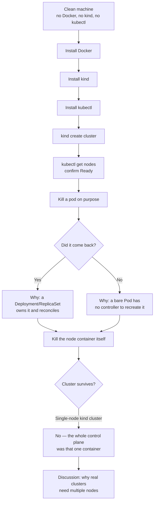

# Session 1 — Cluster up, broken on purpose

Get a `kind` (Kubernetes in Docker) cluster running locally, then
deliberately kill pods and nodes to see what Kubernetes self-heals — and
what it doesn't.

**Before this session:** [docker-k8s-install.md](docker-k8s-install.md) —
step-by-step Docker + kind + kubectl install, from a completely clean
machine.

**Troubleshooting commands:** [tshoot.md](tshoot.md) — a running log of
useful commands for poking at the cluster (find kubelet inside the node,
check component health, etc.). Keeps growing as we find more.

## Session flow

The point of this session isn't memorizing commands — it's building the
instinct for **what Kubernetes self-heals automatically vs. what requires
a human (or Claude) to notice and fix.**

Content for the live kill-pods-and-nodes exercise goes here as it's taught.
