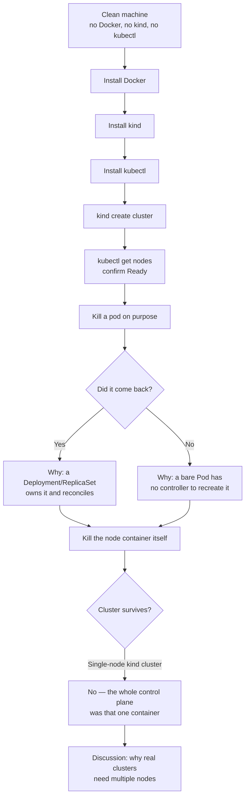

# Session 1 — Cluster up, broken on purpose

Get a `kind` (Kubernetes in Docker) cluster running locally, then
deliberately kill pods and nodes to see what Kubernetes self-heals — and
what it doesn't.

**Before this session:** [docker-k8s-install.md](docker-k8s-install.md) —
step-by-step Docker + kind + kubectl install, from a completely clean
machine.

**Troubleshooting commands:** [tshoot.md](tshoot.md) — a running log of
useful commands for poking at the cluster (find kubelet inside the node,
check component health, etc.). Keeps growing as we find more.

## Session flow

The point of this session isn't memorizing commands — it's building the
instinct for **what Kubernetes self-heals automatically vs. what requires
a human (or Claude) to notice and fix.**

Content for the live kill-pods-and-nodes exercise goes here as it's taught.

## What CNI is `kind` actually using?

`kind` ships with **kindnet** by default — its own minimal CNI plugin, not
a general-purpose one like Calico or Cilium. Here's how it stacks up
against what you could swap in instead:

| CNI | Dataplane | Strengths | Weaknesses | Best fit |
|---|---|---|---|---|
| **kindnet** (current) | iptables + veth (ptp plugin) | Zero-config, ships with `kind` by default, tiny footprint, basic NetworkPolicy support | No BGP/overlay choice, no encryption, no observability tooling, not meant for prod | Local labs, CI ephemeral clusters, exactly what you're using it for |
| **Flannel** | VXLAN overlay (or host-gw) | Dead simple, very mature/stable, minimal resource use, easy mental model | No NetworkPolicy enforcement at all (needs Calico bolted on for that), no encryption, basic feature set only | Small/simple clusters that don't need network policies |
| **Calico** | iptables/eBPF, optional BGP (no overlay needed on-prem) | Industry-standard NetworkPolicy engine (incl. `GlobalNetworkPolicy`, deny rules), BGP peering for real routing, battle-tested at scale, optional eBPF mode for performance | Heavier to operate, BGP mode needs real network cooperation, more moving parts to debug | Production clusters, anywhere you need real policy enforcement |
| **Cilium** | eBPF (no iptables) | Very high performance, deep L3-L7 visibility (Hubble), can replace kube-proxy, built-in encryption (WireGuard/IPsec), service mesh-lite features | Steeper learning curve, eBPF requires modern kernel, more resource overhead, overkill for a lab | Performance-sensitive prod, service-mesh-adjacent use cases, teams wanting observability |
| **Weave Net** | VXLAN overlay | Simple multi-host networking, built-in encryption option, auto mesh discovery | Project is in maintenance mode / reduced momentum, fewer features than Calico/Cilium | Legacy clusters already using it |

kindnet is the right call here — no setup tax. If you want to see a real
CNI's NetworkPolicy enforcement in action later, `kind create cluster
--config` supports `disableDefaultCNI: true`, letting you install Calico
yourself instead.
