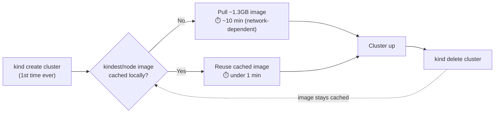

# Installing Docker + kind (Kubernetes in Docker)

Step-by-step walkthrough to get a local Kubernetes cluster running before
session 1. If you already passed `prework/check.sh`, Docker is done —
jump to [Step 2](#step-2-install-kind).

## Step 1: Install Docker

`kind` runs Kubernetes nodes as Docker containers, so Docker has to be
installed and the daemon running first.

### macOS

Download and install [Docker Desktop](https://www.docker.com/products/docker-desktop/),
then launch it from Applications. Wait for the whale icon in the menu bar to
stop animating — that means the daemon is up.

Verify:

```bash
docker --version
docker info
```

`docker info` must succeed (not just `docker --version`) — that's the
check that confirms the daemon is actually running, not just installed.

### Linux

```bash
curl -fsSL https://get.docker.com | sh
sudo usermod -aG docker "$USER"
```

Log out and back in (group membership doesn't apply to your current shell
until you do), then verify the same way:

```bash
docker info
```

### Windows

Install [Docker Desktop](https://www.docker.com/products/docker-desktop/)
with the WSL2 backend (the installer prompts for this — accept it). Run
all commands in this guide from a WSL2 terminal (Ubuntu), not PowerShell.

## Step 2: Install kind

`kind` (Kubernetes IN Docker) is a single static binary — no package
manager required, though package managers work too.

### macOS

```bash
brew install kind
```

No Homebrew? Download the binary directly:

```bash
curl -Lo ./kind https://kind.sigs.k8s.io/dl/v0.24.0/kind-darwin-arm64
chmod +x ./kind
sudo mv ./kind /usr/local/bin/kind
```

(Use `kind-darwin-amd64` instead if you're on an Intel Mac — check with
`uname -m`: `arm64` = Apple Silicon, `x86_64` = Intel.)

### Linux

```bash
curl -Lo ./kind https://kind.sigs.k8s.io/dl/v0.24.0/kind-linux-amd64
chmod +x ./kind
sudo mv ./kind /usr/local/bin/kind
```

### Windows (WSL2)

Same as Linux, run from your WSL2 terminal.

### Verify

```bash
kind version
```

## Step 3: Install kubectl

`kubectl` is the command-line tool you'll use to talk to the cluster.

### macOS

```bash
brew install kubectl
```

### Linux / WSL2

```bash
curl -LO "https://dl.k8s.io/release/$(curl -L -s https://dl.k8s.io/release/stable.txt)/bin/linux/amd64/kubectl"
chmod +x kubectl
sudo mv kubectl /usr/local/bin/
```

### Verify

```bash
kubectl version --client
```

## Step 4: Create your first cluster

```bash
kind create cluster --name playground
```

⚠️ **The first run can take 10+ minutes — this is normal, not stuck.**
`kindest/node` is a ~1.3GB image (it bundles a full Kubernetes control
plane), so the very first pull on a fresh Docker install is the slowest
part of this entire walkthrough by far. The spinner next to
`Ensuring node image (kindest/node:v...) 🖼️` can sit there for several
minutes with no visible progress bar — **let it keep running.** Every
subsequent `kind create cluster` (even a different cluster name) reuses
the already-pulled image and comes up in under a minute.

If you want to confirm it's actually working and not frozen while you
wait, open a second terminal and watch Docker pull the image in
real time:

```bash
docker images   # size climbs from nothing to ~1.3GB as the pull progresses
```



The slow part only happens once per machine — deleting and recreating
the cluster afterward (which you'll do constantly in this mentorship)
stays fast because the image never goes away unless you explicitly
`docker rmi` it.

You'll see output ending in something like:

```
 ✓ Ensuring node image (kindest/node:v1.37.0) 🖼️
 ✓ Preparing nodes 📦
 ✓ Writing configuration 📜
 ✓ Starting control-plane 🕹️
 ✓ Installing CNI 🔌
 ✓ Installing StorageClass 💾
Set kubectl context to "kind-playground"
You can now use your cluster with:

kubectl cluster-info --context kind-playground
```

`kind` automatically points your `kubectl` config at the new cluster — no
manual context-switching needed.

## Step 5: Confirm it's alive

```bash
kubectl get nodes
```

Expected output: one node, `STATUS = Ready` (exact `VERSION` will vary —
`kind` tracks current Kubernetes releases):

```
NAME                       STATUS   ROLES           AGE   VERSION
playground-control-plane   Ready    control-plane   49s   v1.37.0
```

Also check that Docker sees it as a running container — this is the part
that makes `kind` different from a "real" multi-machine cluster:

```bash
docker ps --filter "name=playground"
```

You should see a single container named `playground-control-plane`. That
container **is** your Kubernetes node.

### Why isn't my cluster in the Docker Desktop UI?

If you open Docker Desktop and click **Kubernetes** in the sidebar, you
won't see `playground` there — and that's expected, not a bug. Docker
Desktop's Kubernetes tab only shows/manages **its own** built-in
single-node cluster (the one behind that screen's "Create cluster"
button). `kind` never asks Docker Desktop to manage anything — it just
runs Kubernetes components inside plain Docker containers, so it's
invisible to that specific tab.

To see your `kind` cluster in the GUI, click **Containers** instead —
`playground-control-plane` shows up there like any other container.

### Where does kubectl even know about this cluster?

`kubectl` reads cluster definitions from `~/.kube/config`. `kind`
automatically wrote an entry into that file when you ran
`kind create cluster`. Look at it yourself:

```bash
cat ~/.kube/config
```

You'll see three sections — `clusters` (server address + CA cert),
`contexts` (which cluster + which user), and `users` (credentials) — plus
a `current-context` line at the bottom telling `kubectl` which one to use
by default:

```yaml
contexts:
- context:
    cluster: kind-playground
    user: kind-playground
  name: kind-playground
current-context: kind-playground
```

**Gotcha:** if you ever previously enabled Docker Desktop's own
Kubernetes (the "Create cluster" button from the section above), you may
also see a `docker-desktop` context in this file — even after you've
turned that off or reinstalled Docker Desktop entirely. `kubectl config
get-contexts` lists every cluster it's ever been told about, *not* only
the ones currently running:

```bash
kubectl config get-contexts
```

```
CURRENT   NAME              CLUSTER           AUTHINFO          NAMESPACE
          docker-desktop    docker-desktop    docker-desktop
*         kind-playground   kind-playground   kind-playground
```

The `*` marks which context is *active* — that's the one that matters.
A context with no `*` can easily be pointing at a cluster that's long
gone; trying to use it fails loudly, which is how you can tell:

```bash
kubectl --context docker-desktop get nodes
# The connection to the server 127.0.0.1:... was refused
```

That's a dead context, safe to ignore or clean up with
`kubectl config delete-context docker-desktop`.

## Step 6: Clean up (when you're done experimenting)

```bash
kind delete cluster --name playground
```

This is fully disposable — destroy and recreate as often as you want
during this mentorship. Nothing here is meant to be kept running
long-term.

---

**Next:** session 1 proper — kill pods and nodes on purpose and watch what
Kubernetes self-heals (and what it doesn't).
